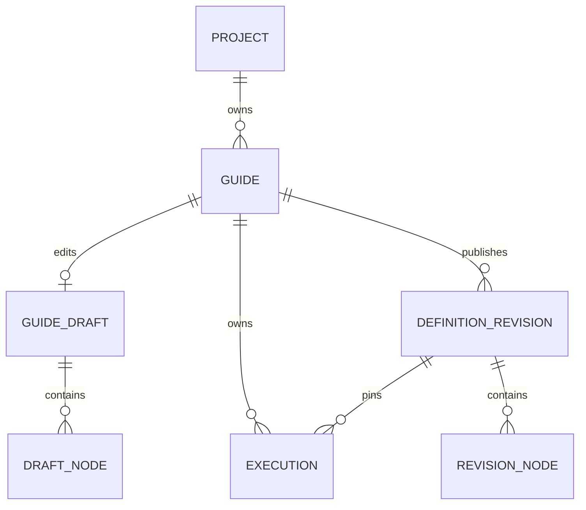
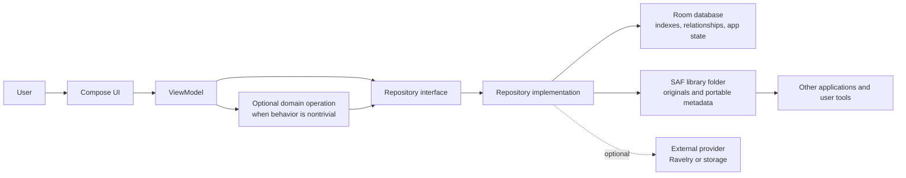
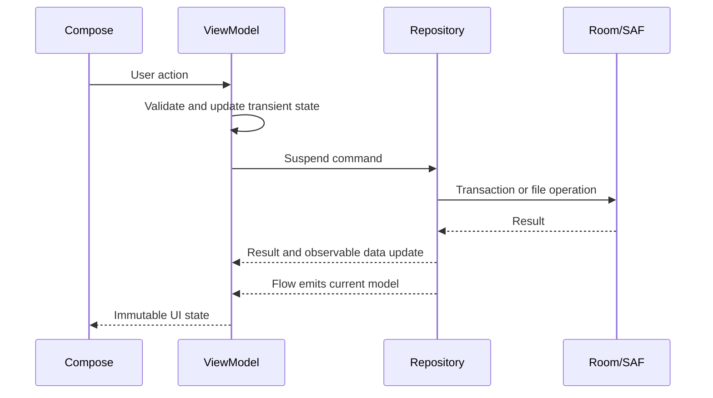

# Stitchbook Architecture

## 1. Status and intent

This document primarily describes the intended architecture. Stitchbook currently has one Android `app` module containing a Material 3 application shell, five top-level destinations, basic Room-backed project CRUD, the pure execution-engine domain model, guide-definition persistence, execution persistence, and a first Focus Mode UI over that persistence. Architecture should continue to be introduced incrementally as product phases require it.

### Current project persistence

The implemented project slice follows the documented data/domain/UI boundaries without a dependency-injection framework:

- `StitchbookApplication` owns a lazy `DefaultAppContainer`.
- The container creates the singleton `StitchbookDatabase` and exposes `ProjectRepository`.
- `LocalProjectRepository` maps between Room entities and the domain `Project`.
- Screen-level ViewModels observe repository `Flow`s and perform save/delete operations.
- Route composables obtain the ViewModels; child composables receive state and callbacks only.

Project-list and project-detail observations are lifecycle-aware and stop upstream Room collection while their destinations have no active subscribers. The project form survives recomposition and ordinary configuration changes because its state is held by its navigation-entry-scoped ViewModel. Unsaved form input is not yet restored after full process death; adding `SavedStateHandle` restoration is deferred, and Room remains the durable source only for successfully saved projects.

Database version 1 introduced the `projects` table:

| Column | Storage | Meaning |
| --- | --- | --- |
| `id` | non-null text primary key | Application-generated UUID string |
| `name` | non-null text | Trimmed project name |
| `craft` | non-null text | Explicit stable craft storage key |
| `project_type` | non-null text | Explicit stable project-type storage key |
| `status` | non-null text | Explicit stable status storage key |
| `notes` | nullable text | Optional private notes |
| `created_at` | non-null integer | Unix epoch milliseconds |
| `updated_at` | non-null integer | Unix epoch milliseconds |

The DAO orders projects by Active, Planned, Paused, Completed, then Abandoned; records within a status are ordered by most recently updated first with deterministic name/ID tie-breakers.

Database version 2 adds persisted guide definitions. Database version 3 adds persisted Execution state. Database version 4 adds `library_items` (pattern references: title, craft, author, source link, comma-joined tags, notes, bookmarked) and `stash_items` (yarn/tool inventory records). Database version 5 adds three nullable columns to `library_items` -- `pdf_uri`, `pdf_file_name`, `pdf_last_viewed_page` -- for an optional PDF attachment selected through the Storage Access Framework; the original PDF is referenced by its persisted-permission `content://` URI only, never copied into the database or app-private storage (see PRODUCT_SPEC.md §6.5). All migrations `1 -> 2` through `4 -> 5` are non-destructive and preserve existing rows. The schema is exported under `app/schemas`; every future schema version must provide and test an explicit migration from each supported prior version and update the exported schema. The production database builder deliberately does not use destructive migration fallback.

### Current guide-definition persistence

The v1 guide ownership model is:



- A `Guide` belongs to exactly one project. A project may own multiple guides.
- Guides are not shared or reusable across projects in v1; a future copy operation may create a distinct guide under another project.
- Each guide has at most one editable `GuideDraft`. This is a deliberate database-level constraint — a unique index on the draft's guide-ID column — not merely a repository-layer convention; the schema itself rejects a second draft for the same guide. A draft may be empty or temporarily fail execution-engine validation, but its stored node rows must still form one ownership-safe tree.
- Each `DefinitionRevision` is a validated, immutable snapshot. Its stable revision ID is authoritative; its monotonically increasing per-guide revision number is display and ordering metadata. Revisions are never updated in place and never deleted individually; the only way a revision disappears is as part of a guide-level cascade delete, which is why the draft's reference to its base revision uses `ON DELETE SET NULL` rather than `CASCADE`.
- Draft nodes and revision nodes are separate normalized rows. Composite identities and self-referencing foreign keys preserve stable node IDs, parent ownership, and child order without storing expanded runtime occurrences.
- Publishing runs in one Room transaction: load the draft, map and validate it with the canonical domain validator, allocate the next revision number, insert the revision and its owned node rows, then point the same editable draft at the new base revision. Failure rolls back the whole publication.
- After publication, the draft keeps its own editable node rows as a synchronized copy of the published content. Later draft saves cannot mutate earlier revision rows; publishing a correction creates a new revision.
- Draft replacement uses a small version field for optimistic concurrency so a stale editor cannot silently overwrite a newer save.
- Project deletion cascades through guides to drafts, revisions, and their nodes. Guide deletion has the same aggregate-level cascade below the guide.

The repository layer exposes guide metadata, full-draft aggregate reads and atomic replacement, immutable revision reads, and publication. `GuideRepository.getLatestRevision(guideId)` is the single authoritative implementation of "the Guide's latest published Revision" -- the revision a new Execution starts from, per the Focus Mode entry rule stated below. "Latest" means the highest `revisionNumber` for that guide, which this section already establishes as monotonically increasing per-guide ordering metadata; the method exists so that operational definition lives in exactly one place rather than being reimplemented as ad hoc ordering logic in a ViewModel. (It is implemented by reusing the same `revision_number DESC` query the data layer already used internally for draft creation, but that reuse is an implementation detail -- the rule itself comes from the Focus Mode contract, not from that query.)

`GuideRepository` declares its own `DraftValidationException` and `DraftVersionConflictException` (in `domain.repository`), mirroring `ExecutionVersionConflictException`'s role for Executions: `LocalGuideRepository.saveDraft` translates the concrete data-layer tree-validation and optimistic-concurrency-conflict exceptions into these before they cross the repository boundary, so callers such as the Draft editor's ViewModel depend only on the domain contract, never on a `data.database` type.

### Current execution persistence

The v1 execution ownership model is:

- An `Execution` belongs to exactly one `Guide` and permanently references the exact immutable `DefinitionRevision` it was created from. An Execution never switches revisions: if the owning Guide later publishes a newer revision, every existing Execution keeps pointing at the revision it started with, unaffected. Progress reconciliation between revisions remains deliberately deferred.
- A Guide may retain multiple historical Executions. In v1, at most one Execution per Guide may be ACTIVE at a time; this is enforced at the database level by a one-row-per-guide "active execution" pointer table (unique on guide ID), not only by repository-level logic. Completed Executions remain queryable as history; v1 does not support restarting, abandoning, or deleting an individual Execution.
- Persisted execution state is the current pointer (a structural Execution Address: revision ID, Instruction node ID, and ordered ancestry frames — never a display string or list index), the set of completed occurrence addresses, and an explicit ACTIVE/COMPLETED status. Ancestry frames and completed occurrences are stored as normalized ordered rows, not a permanently expanded row per generated runtime step.
- All Complete, Previous, and Jump behavior is delegated to the existing pure execution-engine domain functions; the data layer only loads persisted state into that engine, applies its result, and persists the outcome. It does not reimplement traversal or transition rules.
- Each progress action (Complete, Previous, or Jump) is applied in one Room transaction: load the Execution and its immutable Definition Revision, map to the pure domain model, validate, apply the pure-domain transition, and persist the result atomically, or roll back entirely. This matches the crash-safety and immediate-persistence expectations in [docs/EXECUTION_ENGINE_SPEC.md](docs/EXECUTION_ENGINE_SPEC.md).
- Draft-style optimistic concurrency (a `version` field checked against a caller-supplied expected version) protects each transition the same way it protects Draft saves.
- Deleting a Guide cascades to its Executions. A Definition Revision cannot be deleted independently while an Execution still references it.

### Current Focus Mode

Focus Mode is the first UI consumer of Guide and Execution persistence. Its scope is intentionally minimal:

- Opening a Guide from its Project's detail screen continues the Guide's ACTIVE Execution when one exists, or offers to start a new one (from the Guide's latest published Revision) when none does.
- The `GuideFocusViewModel` only loads persisted state via `GuideRepository`/`ExecutionRepository` and renders whatever they return; Complete, Previous, and Jump are single calls into `ExecutionRepository`, never reimplemented in the ViewModel or Compose layer. The screen distinguishes ACTIVE from COMPLETED purely by reading the persisted `ExecutionStatus`, never by a UI-side check such as "is this the last instruction."
- Structural context (Section breadcrumbs, "Row x of y", "Repeat x of y") is derived at render time from the current Execution Address's ancestry frames plus the already-loaded Guide Definition; none of it is stored as new execution state. Rendering Section breadcrumbs specifically needed one small, non-transition addition to the pure engine: `GuideTraversal.ancestryNodePath()`, which exposes the same ancestor-node walk the engine already performs internally (a Section contributes no `AncestryFrame`, so its title cannot be read off an address alone).
- Jump is deliberately narrow in this MVP: the only exposed target is "resume at the earliest incomplete step," computed via the engine's own traversal. A general jump-to-any-occurrence picker is Pattern Map's job and remains out of scope here.
- Because Focus Mode was built before the manual guide editor (delivery-sequence item 3), it operates on whatever Guides and Revisions already exist and never authors content itself; authoring is the Draft editor's job, described below.
- `ExecutionRepository` declares its own `ExecutionVersionConflictException` (in `domain.repository`) as the documented contract for a stale optimistic-concurrency write; `LocalExecutionRepository` translates the concrete data-layer exception into it before it crosses the repository boundary, so callers such as Focus Mode's ViewModel depend only on the domain contract, never on a `data.database` type.
- Focus Mode's presentation is styled entirely through the semantic roles defined by the first version of the Stitchbook design system (`ui/theme`, `ui/components`; see [DESIGN_SYSTEM.md](DESIGN_SYSTEM.md)) rather than hardcoded colors or ad hoc styling. That visual pass changed only rendering: it introduced no new ViewModel state, repository calls, or execution-engine behavior.
- A Project's Guide list is the entry point into Focus Mode and states, per Guide, exactly what its own entry action offers: `ProjectDetailViewModel` resolves one of Continue (an ACTIVE Execution already exists), Start (no ACTIVE Execution, but a published Revision does), or not executable (Draft-only -- a Guide that has never published a Revision) purely by reading `ExecutionRepository.getActiveExecution` and `GuideRepository.getLatestRevision`; it never decides completion, traversal, or revision selection itself, and an ACTIVE Execution always takes priority over Start. A not-yet-executable Guide's card stays tappable, but now opens the Draft editor (described below) instead of Focus Mode -- Focus Mode has nothing to execute for a Guide that has never published a Revision. Navigation into Focus Mode passes only the Guide's stable ID; `GuideFocusViewModel` reloads authoritative Execution and Definition state from Room on every creation, so it renders the same persisted address and completion records after Activity, ViewModel, or process recreation without any navigation-carried execution state.
- Complete, Previous, and the "resume at earliest incomplete step" Jump are each one call into `ExecutionRepository`, guarded by a single `isBusy` flag so a second tap while a write is in flight is a no-op rather than a second concurrent transition; the same flag disables the Complete/Previous/Jump controls in the UI. An `ExecutionVersionConflictException` (another transition committed first) reloads authoritative persisted state and surfaces a recoverable, dismissable feedback message rather than retrying the original transition automatically; the reload itself clears `isBusy`, so the screen is immediately usable again for the next action. This wiring was confirmed by inspection to already exist, and is backed by focused JVM tests for duplicate-submission guarding and post-conflict recovery and a Compose test for the disabled-while-busy render, all of which pass. A production-navigation instrumented test driving Start/Complete/Previous/Continue through the real navigation graph with real persisted state was also added and compiles, but has not executed successfully in this environment -- it is blocked by the same pre-existing Espresso/emulator `InputManager.getInstance` incompatibility affecting every Compose-based instrumented test here, not by anything specific to this wiring.

### Current guide authoring

The manual guide editor (delivery-sequence item 3) now covers the full authoring loop end to end: creating a Guide, editing its Draft, publishing it, and reaching Focus Mode -- delivered as two slices, Draft Editor Foundation and Publish and Knit.

- A Project's "Add Guide" action calls `GuideRepository.createGuide` (which also creates the Guide's one empty Draft, per the schema above) and navigates straight into the Draft editor for the new Guide; there was previously no in-app way to reach this repository method at all.
- The Draft editor (`feature/draft`) renders the Draft's node tree as a flattened, indented outline (`DraftEditorViewModel` computes this by walking `rootNodeIds`/`children`; the screen never walks the tree itself) supporting the four node types the canonical model already defines: Section, Range, Repeat, Instruction. Add, edit, delete (cascading to descendants), and reorder-within-siblings are each one `GuideRepository.saveDraft` call; there is no separate longer-lived unsaved buffer the ViewModel could let diverge from what Room holds -- `uiState` always reflects either the last successfully persisted Draft or, while a save is in flight, the previously persisted one.
- A structural save failure (`DraftValidationException`) or an optimistic-concurrency conflict (`DraftVersionConflictException`, another save committed first) each surface a recoverable, dismissable message and leave the editor on the last known-good persisted state -- reusing the same reload-on-conflict shape Focus Mode already established for Executions -- rather than crashing or silently discarding the attempted edit.
- Publishing is one `GuideRepository.publishDraft` call from a Publish action in the same editor. `LocalGuideRepository.publishDraft` translates every publish-time failure into the same two domain exceptions saving already uses: field-completeness and content/structure errors (a missing required field, an empty container, invalid Range bounds, and so on) become `DraftValidationException`; the draft row being concurrently changed or gone becomes `DraftVersionConflictException` -- there is no separate publish-specific exception type, and no UI code independently guesses whether a Draft is valid before offering Publish. A successful publish reloads the Draft (its `base_revision_id`/`version` changed as part of publishing) so the next save never spuriously conflicts against the pre-publish version, then re-checks `GuideRepository.getLatestRevision`/`ExecutionRepository.getActiveExecution` to decide whether to offer Start or Continue. The Draft remains fully editable afterward -- a later correction publishes as a new Revision the same way, the domain's monotonic-revision-number guarantee applies unchanged.
- Once published, the editor offers "Start Knitting" or "Continue Knitting" (Continue whenever an ACTIVE Execution already exists, exactly the same "ACTIVE always wins" rule `ProjectDetailViewModel` already applies) as a direct, obvious next action; tapping it only navigates to Focus Mode for that Guide -- it never creates or mutates an Execution itself, since Focus Mode's own Start action already owns that.
- A small set of manual-testing-driven usability corrections ship alongside Publish, scoped to copy and layout only, not new behavior: a plain-language empty-state prompt, a one-line explanation next to each node type at the point of choice in the "choose a step" dialog, the Range type's user-facing label changed to "Row range", the Instruction field's label changed to "What to knit", the Repeat count field's label changed to "How many times?", and the bottom action row reorganized so Publish (and, once published, Start/Continue Knitting) reads as the obvious primary action rather than competing evenly with Add step/Done.
- This wiring was confirmed by inspection to exist and is backed by passing focused JVM tests (`DraftEditorViewModelTest`, plus `ProjectDetailViewModelTest` coverage for guide creation) covering add/edit/delete/reorder for every node type, publish success, publish-time validation feedback, publication leaving the Draft editable, Start/Continue exposure, duplicate-submission guarding, and conflict recovery, plus a presentation-only Compose test (`DraftEditorScreenTest`) for the revised copy and action hierarchy. Three production-navigation instrumented tests (adding a Guide and authoring a step; publishing a Guide and reaching Focus Mode's Ready-to-start screen; a Draft-only Guide's card opening the editor) were added and compile, but have not executed successfully in this environment -- blocked by the same pre-existing Espresso/emulator `InputManager.getInstance` incompatibility as every other Compose-based instrumented test here, not by anything specific to this wiring.

Patterns, yarn, tools, photos, counters, sessions, construction details, dates, and portable export are not represented in the current schema.

Automatic Android app backup is disabled for the current milestone so private project notes are not copied to a cloud backup implicitly. Consequently, uninstalling the app or clearing application data removes the local database. This is a known temporary limitation until user-controlled project export and complete backup/restore are implemented.

The design optimizes for user ownership, offline reliability, explicit state, and approachability for a developer who is experienced in programming but new to shipping complete Android applications.

## 2. Architectural principles

1. **Local first:** essential reads and writes do not depend on a network.
2. **Portable content is primary:** original files and portable records remain accessible outside the app.
3. **Room supports local operation:** it provides indexes, relationships, transactions, and app state, but release-ready durable records also need a proportionate user-accessible export.
4. **Single source of truth per concern:** repositories define which local source is authoritative for a given operation and expose coherent results.
5. **Unidirectional data flow:** UI renders immutable state and sends explicit actions.
6. **Dependencies point inward:** UI depends on domain contracts; implementation details stay in data/storage layers.
7. **Incremental complexity:** one module is sufficient until measurable pressure justifies splitting it.
8. **Reviewable automation:** imports, merges, parsing, and synchronization show provenance and require review when ambiguity exists.

## 3. Portable files and Room

The long-term library has two cooperating parts:

- **User-selected library folder:** original PDFs, photos, exports, and versioned portable metadata. Access is obtained through the Android Storage Access Framework.
- **Room database:** normalized indexes, relationships, search fields, application state, counters, sessions, pending operations, and cached projections.

Room may be authoritative for rapidly changing operational state such as an in-progress counter, but durable user records must be included in a user-accessible export before that feature is release-ready. Original files must never exist only as opaque database blobs, application-private files, or private cache entries. Early phases may use a simple versioned JSON export through `ACTION_CREATE_DOCUMENT`; they do not need the full library folder, mirroring, or restore engine planned for later phases.



Do not build dual-write infrastructure during the initial Room phase. A user-initiated snapshot export can read a consistent Room snapshot and write one versioned document directly.

When later phases introduce continuous portable mirroring, writes that affect both Room and portable metadata cannot be one atomic filesystem/database transaction. At that point, use a small explicit operation record:

1. Validate the requested change.
2. Commit the local database transaction and record portable work as pending.
3. Write a new portable file safely, using create-then-replace or versioned files where the provider permits.
4. Mark the operation complete and store checksums/revision information.
5. Retry recoverable work with WorkManager only when durable background retry improves the user experience, and surface persistent failures.

Never overwrite original imported files. Portable metadata writes should be recoverable and should not imply success until the provider confirms completion.

## 4. Recommended layers

These are responsibility boundaries, not a requirement to create every class or package immediately. Phase 1 can remain mostly UI. Phase 2 should add only the ViewModel, repository seam, Room code, and models needed for project CRUD and export. Do not create separate persistence/domain models, mappers, or use-case classes when they would be identical pass-throughs; introduce them when platform leakage, invariants, multiple data sources, or testing needs make the separation valuable.

### UI layer

- Compose screens and focused reusable components
- Navigation destinations
- ViewModels
- Immutable screen state
- User actions and one-time effects

Composables render state and emit actions. They do not query Room, manipulate SAF documents, perform calculations with business meaning, or coordinate synchronization.

### Domain layer

- Domain models with explicit types and invariants
- Repository interfaces
- Focused use cases where behavior spans repositories or contains nontrivial rules
- Pure calculations for gauge, counters, estimates, statistics, allocations, and conflicts
- A pure execution-engine component that traverses reviewed guide definitions, keeps execution state separate, and produces deterministic leaf-level progress commands

Do not create one-line use cases merely to satisfy a diagram. Simple repository calls may be made directly from a ViewModel until added logic justifies a use case.

The execution engine is a core domain component, not parser or UI logic. Its pure model, validation, traversal, and transitions operate on immutable guide definitions and separate execution state. Guide definitions and revisions are now persisted, but execution state is not. Focus view, Pattern Map, manual authoring, and deterministic parsing remain future clients of the same behavior. Its leaf-pointer invariant, traversal rules, atomic progress expectations, and v1 limits are defined in [docs/EXECUTION_ENGINE_SPEC.md](docs/EXECUTION_ENGINE_SPEC.md).

### Data layer

- Room entities, DAOs, database, and migrations
- Repository implementations
- Mappers between persistence, portable, external, and domain models
- SAF storage adapter and document metadata
- Import/export serializers
- Optional external integration clients
- WorkManager workers for durable deferred work

Platform types such as `Uri`, database entities, and API DTOs should not leak unnecessarily into domain models.

## 5. Data flow and UI state



Recommended ViewModel conventions:

- Expose `StateFlow<ScreenUiState>`.
- Model loading, empty, content, and error states explicitly.
- Accept actions through named functions or a sealed action type when a screen has many events.
- Use `SavedStateHandle` for navigation arguments and small restorable transient state, not as the durable datastore.
- Collect repository `Flow`s with lifecycle-aware Compose APIs.
- Represent one-time navigation or user messages carefully; do not encode durable facts as lossy events.
- Keep mutable collections private and publish immutable snapshots.

Fast counter actions may use an optimistic UI update only if failed persistence is surfaced and state is reconciled. Correctness is more important than animation.

## 6. Repository contracts

Define repository interfaces in the domain layer around user intentions rather than database tables. Examples include:

- `ProjectRepository`
- `GuideRepository`
- `ExecutionRepository`
- `CounterRepository`
- `PatternRepository`
- `YarnRepository`
- `ToolRepository`
- `SessionRepository`
- `LibraryRepository`

Contracts should:

- Return domain models or typed results.
- Expose observation with `Flow` when ongoing changes matter.
- Use suspend functions for commands and snapshots.
- State whether delete means record removal, external-file deletion, or both.
- Preserve provenance and recorded-versus-estimated markers.
- Avoid generic “base repository” abstractions that erase meaningful operations.

Repository implementations may coordinate DAOs and storage adapters. Cross-record operations such as yarn allocation or linked counters should execute in Room transactions.

## 7. Navigation

The implemented shell uses Navigation Compose with a single activity, one navigation host, and five centralized top-level routes:

- Home
- Projects
- Library
- Stash
- Settings

The phone layout exposes these routes through a Material 3 bottom navigation bar. `Home` is the start destination. Top-level navigation uses single-top behavior plus saved/restored destination state, while the system Back action retains standard `NavController` behavior. Future detail destinations should be added within this graph only when their features exist.

The Projects feature currently adds centralized create, detail, and edit routes. Detail/edit routes pass only the project UUID string; project objects are reloaded from the repository at the destination. The bottom navigation bar is hidden on these child routes to avoid bypassing unsaved-change handling.

- Pass stable IDs, not serialized full objects, between destinations.
- Load current data from repositories at the destination.
- Centralize route definitions and argument parsing.
- Support deep links only when there is a real use case and an explicit privacy review.
- Adapt the top-level navigation component to larger screen sizes when that work is justified, without creating separate business flows.
- Avoid nested graphs until a feature's flow benefits from them.

## 8. Storage Access Framework

Early safety exports should use `ACTION_CREATE_DOCUMENT` so the user explicitly chooses each destination without requiring a permanent library setup. When the pattern library and portable library arrive, the user should select a library directory using `ACTION_OPEN_DOCUMENT_TREE`. Persist URI permissions when the provider grants them and verify access on startup or before work.

Storage code should be isolated behind a `LibraryStorage`-style interface that can:

- Create and enumerate library directories and documents
- Copy an imported PDF without altering the source
- Open a document through a content URI
- Record display name, MIME type, size, modified time, and checksum where available
- Write portable metadata safely
- Detect missing permission or unavailable providers
- Export and restore a versioned library

For a managed import, copy bytes into the selected accessible library while leaving the source untouched. For a linked import, retain the source URI only when durable permission is available and provide relinking when it is not. Never copy a long-lived original into application-private storage as the managed-library copy.

SAF providers have different capabilities. Do not assume filesystem paths, atomic rename, stable modification times, or random access. Store durable content URIs and provider document IDs only when useful, and handle re-selection or relinking.

The app may use internal cache for thumbnails or temporary exports, but cached data must be reproducible and must never be the only copy.

## 9. IDs and relationships

- Give each locally created durable record an application-generated UUID independent of Room row order and external systems.
- Keep external identifiers in namespaced link records, for example provider `ravelry` plus remote type and ID.
- Use explicit join entities for many-to-many relationships such as projects–patterns, projects–yarn lots, projects–tools, and grouped tool components.
- Distinguish a tool template from a generated inventory component and a grouped set from its membership records.
- Treat grouped-set membership as a reference to underlying inventory, not a second stock count. Model connector families and adapters explicitly; store tip/hook, cable, and assembled dimensions with unambiguous units and measurement definitions.
- Store units with values or use typed value objects; do not infer units from locale.
- Use timestamps with a clear meaning. Store instants for events and local dates for date-only concepts such as a project start date.
- Prefer soft archival over deletion where history or synchronization needs it. Do not introduce universal soft deletes without a use case.

## 10. Sync readiness and conflict concepts

No synchronization is required in early phases. Prepare without building a speculative sync framework:

- Use stable UUIDs.
- Track `createdAt` and `updatedAt` for portable records.
- Version portable schemas.
- Preserve external provider IDs separately.
- Keep repository operations explicit and idempotent where practical.
- Record provenance for imported and derived values.

Future synchronization should compare a known base revision with local and remote revisions rather than applying “last write wins” indiscriminately. Potential outcomes are:

- No conflict: apply the only changed side.
- Field-level merge: combine independent changes.
- User-reviewed conflict: show both values and provenance.
- Duplicate: retain both records with an explanation.
- Deletion conflict: never silently destroy the surviving content.

Files use checksums and revision metadata where available. Purchased PDFs and private guides are excluded from automatic remote upload.

## 11. Background work

Use WorkManager for durable, deferrable jobs such as portable metadata reconciliation, backup validation, thumbnail generation, or user-enabled synchronization. Do not use it for precise timers or immediate counter actions.

Workers should be idempotent, constrained only as needed, observable, cancellable where appropriate, and safe to retry. Persistent notifications for active counters are a foreground user experience, not a reason to run unnecessary continuous background work.

## 12. Testing strategy

### Unit tests

- Domain invariants and craft-specific calculations
- Linked counters, schedules, resets, bounds, and cycle prevention
- Gauge, length/weight conversion, estimation, and rounding
- Session aggregation and streak rules
- Yarn allocation and consumption
- Conflict and merge decisions
- Portable schema parsing and migration

### Data and integration tests

- DAO queries, transactions, constraints, and Room migrations
- Repository mapping and error handling
- SAF behavior through fakes plus targeted device tests
- Backup/restore round trips and corrupt or incomplete backups
- Early project/counter export compatibility and import/migration into the full library format
- Import idempotency and missing-file recovery

### UI tests

- ViewModel state transitions
- Critical Compose flows such as project creation and counter operation
- Navigation argument handling
- Accessibility semantics for active crafting controls

Use fakes at domain boundaries; do not mock simple value objects. Keep a small set of end-to-end instrumented tests for platform integration.

## 13. Security and privacy

- Request only permissions needed for a user-initiated operation.
- Use SAF rather than broad storage permissions.
- Do not log pattern text, private notes, file contents, credentials, or sensitive URIs.
- Keep secrets and signing material outside version control.
- Validate imported types and sizes; treat PDFs, metadata, and archives as untrusted input.
- Prevent path traversal and archive expansion abuse during restore.
- Use Android share mechanisms with narrow URI grants.
- Explain what an export or optional synchronization will include before it runs.
- Do not introduce analytics, crash upload, cloud AI, or remote services without an explicit product and privacy decision.
- Treat Android Auto Backup and device transfer as explicit privacy decisions. They are not substitutes for user-controlled export, and private pattern content must not be included accidentally.

## 14. Suggested initial package structure

Create packages only when code exists for them:

```text
com.macareen.stitchbook
├── data
│   ├── database
│   ├── local
│   ├── model
│   ├── repository
│   └── storage
├── domain
│   ├── model
│   ├── repository
│   └── usecase
├── feature
│   ├── dashboard
│   ├── projects
│   ├── patterns
│   ├── yarn
│   ├── tools
│   ├── counter
│   ├── statistics
│   └── settings
├── navigation
├── ui
│   ├── components
│   └── theme
└── util
```

Feature packages may contain a screen, ViewModel, UI state, and feature-specific components. Shared code moves to broader packages only after two or more real consumers demonstrate the need.

## 15. When modules may become worthwhile

Keep the single `app` module initially. Consider extraction only when one or more are measurable:

- Build times materially impede iteration.
- A stable domain or storage component needs isolated tests or reuse.
- Optional integrations need clear dependency isolation.
- Multiple developers need ownership boundaries.
- Dynamic delivery or separate applications become real requirements.

Likely future candidates could be `core:model`, `core:database`, or provider-specific integration modules, but these names are not commitments.

## 16. Decisions deliberately postponed

- Dependency injection library versus a small manual composition root
- Final Room schema and migration policy details
- Exact portable metadata schema and directory layout
- Encryption at rest and user-managed keys
- Thumbnail/image loading library
- Rich text representation for notes
- Search implementation
- Multi-device synchronization protocol and remote providers
- Ravelry authentication and write-back behavior
- PDF rendering, text extraction, and parsing libraries
- Local AI model/runtime and supported devices
- Module splitting
- Analytics or crash reporting

Postpone these until a roadmap phase supplies concrete requirements, constraints, and acceptance tests.
